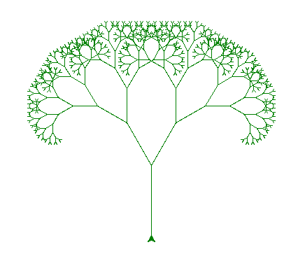

# goit-algo-fp

## task01. Структури даних. Сортування. Робота з однозв'язним списком

```
Зв'язний список:
15 10 5 20 25
Реверсивний список:
25 20 5 10 15
Зв'язний список:
50 20 2 25 15
Відсортований список:
2 15 20 25 50
Список 1:
1 3 5
Список 2:
2 4 6
Об'єднаний список
1 2 3 4 5 6
```

## task02 фрактал “оголене дерево Піфагора”

[Дерево Піфагора](https://uk.wikipedia.org/wiki/%D0%94%D0%B5%D1%80%D0%B5%D0%B2%D0%BE_%D0%9F%D1%96%D1%84%D0%B0%D0%B3%D0%BE%D1%80%D0%B0)

### level = 3


### level = 5


### level = 10



### level = 12


## task03


```
Відстань від A до A дорівнює 0
Відстань від A до B дорівнює 4
Відстань від A до C дорівнює 2
Відстань від A до D дорівнює 4
Відстань від A до E дорівнює 7
Відстань від A до F дорівнює 5
Відстань від A до Z дорівнює 8

```

## task04. Візуалізація піраміди


## task05. Візуалізація обходу бінарного дерева

### Візуалізація обходу в глибину (DFS)


### Візуалізація обходу в ширину (BFS)


## task06 Жадібні алгоритми та динамічне програмування

```
Введіть бюджет (або 0 для виходу): 25

Жадібний алгоритм:
Вибрані страви: ['cola', 'pepsi']
Сумарна калорійність: 320

Алгоритм динамічного програмування:
Вибрані страви: ['potato']
Сумарна калорійність: 350
Введіть бюджет (або 0 для виходу): 40

Жадібний алгоритм:
Вибрані страви: ['cola', 'potato']
Сумарна калорійність: 570

Алгоритм динамічного програмування:
Вибрані страви: ['potato', 'cola']
Сумарна калорійність: 570
Введіть бюджет (або 0 для виходу): 50

Жадібний алгоритм:
Вибрані страви: ['cola', 'potato', 'pepsi']
Сумарна калорійність: 670

Алгоритм динамічного програмування:
Вибрані страви: ['potato', 'cola', 'pepsi']
Сумарна калорійність: 670
Введіть бюджет (або 0 для виходу): 75

Жадібний алгоритм:
Вибрані страви: ['cola', 'potato', 'pepsi']
Сумарна калорійність: 670

Алгоритм динамічного програмування:
Вибрані страви: ['potato', 'cola', 'hot-dog']
Сумарна калорійність: 770
Введіть бюджет (або 0 для виходу): 100

Жадібний алгоритм:
Вибрані страви: ['cola', 'potato', 'pepsi', 'hot-dog']
Сумарна калорійність: 870

Алгоритм динамічного програмування:
Вибрані страви: ['potato', 'cola', 'pepsi', 'pizza']
Сумарна калорійність: 970
Введіть бюджет (або 0 для виходу): 125

Жадібний алгоритм:
Вибрані страви: ['cola', 'potato', 'pepsi', 'hot-dog', 'hamburger']
Сумарна калорійність: 1120

Алгоритм динамічного програмування:
Вибрані страви: ['potato', 'cola', 'pepsi', 'hot-dog', 'hamburger']
Сумарна калорійність: 1120
Введіть бюджет (або 0 для виходу): 0
```

## task07. Використання методу Монте-Карло

```
Порівняння ймовірностей (в %):
Сума  Симуляція  Аналітика  Відхилення
2     2.81       2.78       0.03
3     5.54       5.56       -0.02
4     8.40       8.33       0.07
5     11.06      11.11      -0.05
6     13.96      13.89      0.07
7     16.79      16.67      0.12
8     13.83      13.89      -0.06
9     10.99      11.11      -0.12
10    8.38       8.33       0.04
11    5.56       5.56       -0.00
12    2.69       2.78       -0.09
```
